# this repo covers
i ADVISE YOU GO THROUGH FIRST: https://www.youtube.com/watch?v=AsNTP8Kwu80  AND https://www.youtube.com/watch?v=YCzL96nL7j0&pp=ugUEEgJlbg%3D%3D
      Introducing sequential data
      RNNs for modeling sequences
      Long short-term memory
      Truncated backpropagation through time
      Implementing a multilayer RNN for sequence modeling in PyTorch
      Project one: RNN sentiment analysis of the IMDb movie review dataset
      Project two: RNN character-level language modeling with LSTM cells, using text data from Jules Verne’s The Mysterious Island
      Using gradient clipping to avoid exploding gradients
# sequential data
Recurrent Neural Networks (RNNs) are neural architectures designed to process sequential data by maintaining a hidden state that captures information from previous inputs, allowing the network to recognize temporal dependencies in text, speech, or time series. 
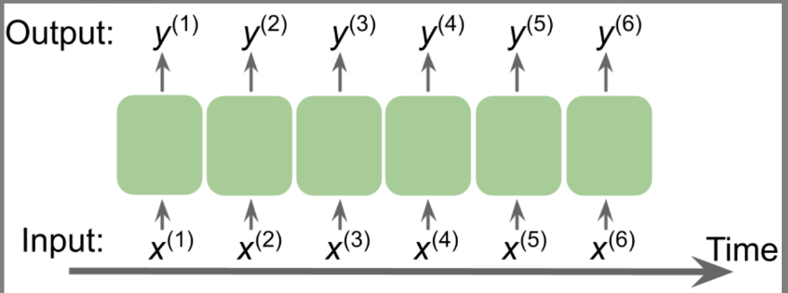

# categories of sequence modeling
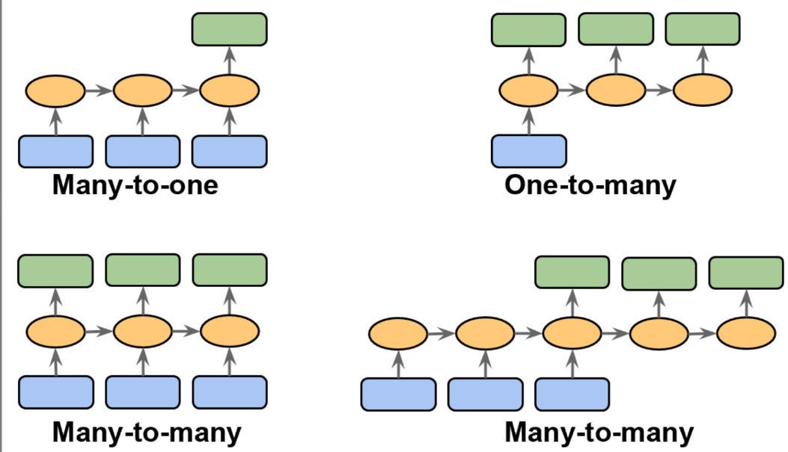
https://karpathy.github.io/2015/05/21/rnn-effectiveness/
please note
One to One : Vanilla mode of processing without RNN, from fixed-sized input to fixed-sized output (e.g. image classification).
One  to many Sequence output (e.g. image captioning takes an image and outputs a sentence of words). 
Sequence input (e.g. sentiment analysis where a given sentence is classified as expressing positive or negative sentiment).
many to many:  Sequence input and sequence output (e.g. Machine Translation: an RNN reads a sentence in English and then outputs a sentence in French). 

# RNNs for modeling sequences
    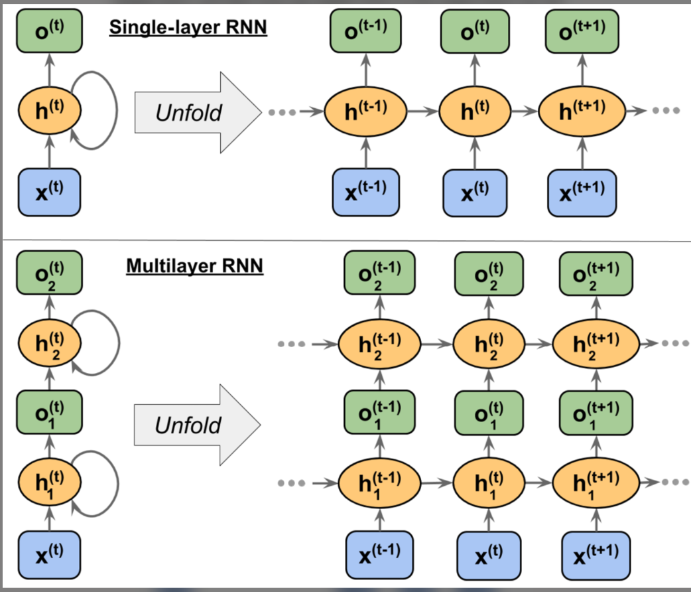
    layer = 1: Here, the hidden layer is represented as  and it receives its input from the data point, x(t), and the hidden values in the same layer, but at the previous time step, .
    layer = 2: The second hidden layer, , receives its inputs from the outputs of the layer below at the current time step () and its own hidden values from the previous time step, .
# Computing activations in an RNN

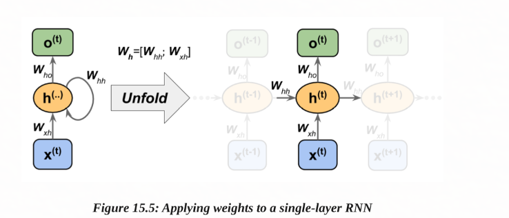
Wxh: The weight matrix between the input, x(t), and the hidden layer, h
Whh: The weight matrix associated with the recurrent edge
Who: The weight matrix between the hidden layer and output layer

activation function: 

activation function of hidden unit
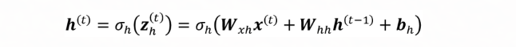

# computing activation:
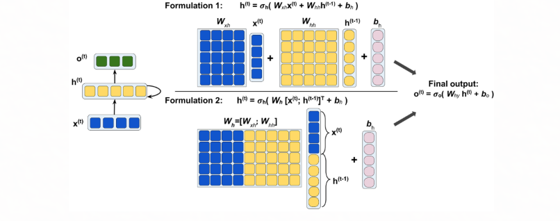

# Back Propagation through time in RNN
this is summary for more info consider:  https://www.geeksforgeeks.org/machine-learning/ml-back-propagation-through-time/
Updating Weights Using BPTT
1. Adjusting Output Weight 
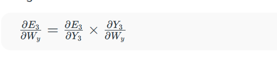
2. Adjusting Hidden State Weight 
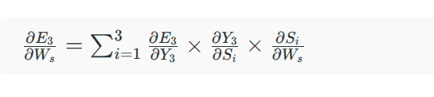
3. Adjusting Input Weight 
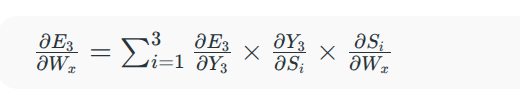

​
# Hidden recurrence versus output recurrence
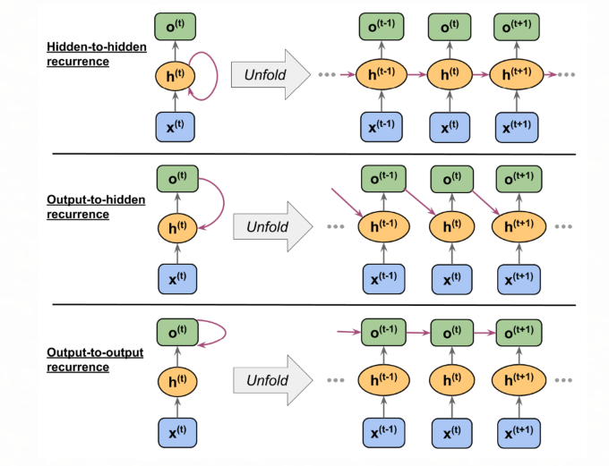

On the difficulty of training recurrent neural networks by R. Pascanu, T. Mikolov, and Y. Bengio, 2012 
(https://arxiv.org/pdf/1211.5063.pdf).

# LSTM
Empirical Evaluation of Gated Recurrent Neural Networks on Sequence Modeling by Junyoung Chung and others, 2014 (https://arxiv.org/pdf/1412.3555v1.pdf).
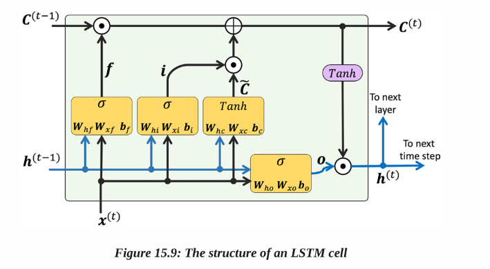
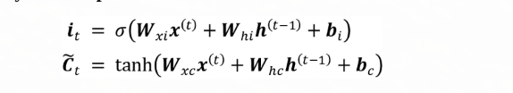

# Implementing RNNs for sequence modeling in PyTorchu

